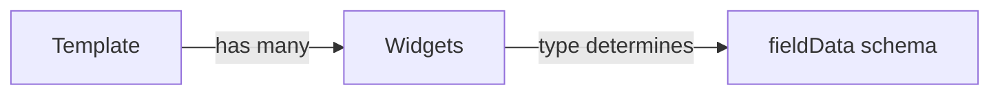

# `vibes/` — Research, Planning & Analysis Docs

AI-assisted planning documents for features, APIs, and PRs. These are working documents: research written before planning, plans annotated before implementation, analyses of existing code. They are developer- and AI-facing documentation, not user-facing docs.

---

## For AI: how to use this folder

1. Glob `vibes/*.md` and read the front matter of each file (~20 lines)
2. Use `status` and `feature` to filter to relevant docs; skip `implemented` unless doing archaeology
3. Read the `## Summary` section to confirm relevance before loading the full doc
4. The full doc only needs loading when `Load when:` matches your current task

---

## Front matter fields

Every doc starts with YAML front matter:

```yaml
---
type: research | plan | analysis
subject: "One-line description"
feature: feature-slug         # omit for cross-cutting or PR docs
status: draft | active | implemented | archived
created: YYYY-MM
updated: YYYY-MM
related-docs:                 # optional
  - other-doc.md
related-prs: [123, 456]       # optional
---
```

| Field | Values | Meaning |
|---|---|---|
| `type` | `research` | Deep codebase analysis. Answers: *what is the current state?* |
| | `plan` | Implementation spec + task list. Answers: *what will we build and how?* |
| | `analysis` | Targeted study of an API, PR, architecture, or tradeoff |
| `status` | `draft` | Incomplete — may have placeholders or unresolved questions |
| | `active` | Being referenced during current implementation |
| | `implemented` | Feature shipped. Retain for archaeology; don't treat as current requirements |
| | `archived` | Superseded or abandoned. Ignore unless researching history |

---

## Naming convention

```
[feature-slug]-[type].md      # template-editor-research.md
pr-[number]-[type].md         # pr-442-analysis.md
```

Use kebab-case. No timestamps in filenames — use git history for that.

---

## `## Summary` section

Every doc has a `## Summary` section immediately after the front matter, before any detailed content. Keep it to 5–8 bullets:

```markdown
## Summary

- **Covers:** [what topics/questions this doc addresses]
- **Does not cover:** [explicit exclusions]
- **Key decisions:** [most important conclusions or choices captured here]
- **Load when:** [the task or question that makes this doc worth reading in full]
```

---

## References, diagrams & citations

Docs should be verifiable and visually clear where it helps.

**Cite primary sources** using markdown footnotes (`[^n]`). Prefer primary sources when facts matter — W3C/WCAG for accessibility, MDN for web APIs, official framework docs for library behavior. Footnotes should point to specific file paths and line numbers for codebase claims (see `template-editor-research.md` for examples of both patterns).

**Include Mermaid diagrams** when they clarify architecture, data flow, or sequences more efficiently than prose. Use fenced code blocks with the `mermaid` language tag:

````markdown

````

**Include screenshots or images** when comparing UI states, documenting legacy behavior, or referencing a design that words can't capture precisely.

---

## Workflow: the annotation cycle

The highest-leverage pattern for planning complex features:

1. Ask Claude to generate a `[feature]-research.md` via deep codebase analysis
2. Review it; add `[YourInitials: ...]` inline notes where Claude got something wrong or missed context
3. *"I added notes — address all notes and update the document. Don't implement yet."*
4. Repeat until research is accurate, then ask Claude to generate a `[feature]-plan.md`
5. Annotate the plan the same way
6. *"Implement it. Mark tasks complete in the plan as you go."*

The plan doc doubles as a progress tracker during implementation.

---

## Referencing docs in a Claude session

Point Claude at relevant docs at the start of a session:

```
Read @vibes/README.md for orientation, then @vibes/template-editor-research.md before we begin.
```

Or use `@vibes/README.md` as an import in `CLAUDE.md` during active feature work. Remove it once the feature ships.
